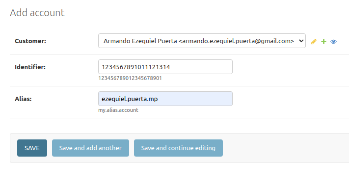

# Stori Software Engineer - Technical Challenge

## The challenge...

Thanks for your interest in joining Stori. At this stage, we ask you to solve the following challenge.

Best of luck!

For this challenge you must create a system that processes a file from a mounted directory. The file will contain a list of debit and credit transactions on an account. Your function should process the file and send summary information to a user in the form of an email.

An example file is shown below; but create your own file for the challenge. Credit transactions are indicated with a plus sign like +60.5. Debit transactions are indicated by a minus sign like -20.46


We prefer that you code in Python or Golang; but other languages are ok too. Package your code in one or more Docker images. Include any build or run scripts, Dockerfiles or docker-compose files needed to build and execute your code.

### Bonus points

1. Save transaction and account info to a database
2. Style the email and include Stori’s logo
3. Package and run code on a cloud platform like AWS. Use AWS Lambda and S3 in lieu of Docker.

### Delivery and code requirements

Your project must meet these requirements:

1. The summary email contains information on the total balance in the account, the number of transactions grouped by month, and the average credit and average debit amounts grouped by month. Using the transactions in the image above as an example, the summary info would be

Total balance is 39.74
Number of transactions in July: 2
Number of transactions in August: 2
Average debit amount: -15.38
Average credit amount: 35.25

2. Include the file you create in CSV format.

3. Code is versioned in a git repository. The README.md file should describe the code interface and instructions on how to execute the code.

## ...And my solution:

I built a set of Docker images (and a docker-compose strategy) to pass the challenge but with the desire of develop a variety of features.

In first place, I wanted to built a backend in Django (using DRF) to manage objects like customer data (names, emails), accounts (identifiers aka CBU/CVU, alias) and email formats. By this way, I could configure the mailing process on the fly. All this stuff would be saved on PostgreSQL database.

In the other hand, I wanted a separate component to manage the async tasks for process csv files and sending emails. This would be built with FlaskRestful and backed with a MongoDB database.

The tasks (or workers) are implemented with Python 3.10 and deployed by other container, called File Processor. Between workers and manager is a RabbitMQ container. It is the communitacion channel and Celery is used on it. In first place I would like to program this workers using Golang (I know a little bit, so I wanted to show my desire to learn it), but I haven't enough time.


Finally, I wanted to build a front with React in other container (I'm learning it right now), to merge the features offered by both Rest API. But, again, I had not enough time to do it.

For that reason we have to use the Admin offered by Django and Postman or curl for the Flask container.

Let's see the prerequisites:
### Env file:

Here it is with default values. Should works fine in the root of the project. For both passwords, ask me for it or build your own.

```bash
STORI_CORE_PORT=8080
STORI_CORE_SECRET_KEY=

POSTGRES_DB=stori_core_db
POSTGRES_USER=postgres
POSTGRES_PASSWORD=stori_pass
POSTGRES_PORT=5432
POSTGRES_DATA_PATH=./data/postgres

RABBIT_MQ_PORT=5672

TASK_MANAGER_PORT=6001
TRX_VOLUME=./input

MONGO_INITDB_ROOT_USERNAME=mongodb
MONGO_INITDB_ROOT_PASSWORD=stori_pass
MONGO_INITDB_DATABASE=stori_task_db
MONGO_HOSTNAME=mongodb
MONGO_PORT=27017
MONGODB_DATA_DIR=./data/mongodb
MONDODB_LOG_DIR=/dev/null

GMAIL_APP_PASSWORD=
```

* `STORI_CORE_PORT`
Host port for the main container (Django Rest Framework), aka Core.

* `STORI_CORE_SECRET_KEY`
A secret key asked by Django.

* `POSTGRES_DB`
The name of the PostgreSQL database.

* `POSTGRES_USER`
The user to connect to the database.

* `POSTGRES_PASSWORD`
And its password.

* `POSTGRES_PORT`
Host port for the PostgreSQL database.

* `POSTGRES_DATA_PATH`
Host path to store all PostgreSQL's files.

* `RABBIT_MQ_PORT`
Host port for the RabbitMQ container.

* `TASK_MANAGER_PORT`
Host port for the Task Manager container (the Flask one).

* `TRX_VOLUME`
Path to the mounted folder. On this path you should put the csv files.

* `MONGO_INITDB_ROOT_USERNAME`
The user to connect to the MongoDB database.

* `MONGO_INITDB_ROOT_PASSWORD`
And its password too.

* `MONGO_INITDB_DATABASE`
Name of the MongoDB database.

* `MONGO_HOSTNAME`
Name of the MongoDB container.

* `MONGO_PORT`
Host port for the MongoDB database.

* `MONGODB_DATA_DIR`
Host path to store all MongoDB's files.

* `MONDODB_LOG_DIR`
Host path to store all MongoDB's log files.

* `GMAIL_APP_PASSWORD`
Password related to your Gmail account, for send automatic emails!

### Docker and Docker-compose

Just common installation.

### Gmail Password


## Deploy

```bash
# on project root
docker-compose up --build
```

After some minutes, everything should be up. Then, in other terminal enter the next commands:
```bash
docker exec -it core python manage.py migrate 
```
With that, you will recreate the whole PostgreSQL database. And the last command is:
```bash
docker exec -it core python manage.py createsuperuser 
```
Follow the steps just to have access to the DRF admin site (if you need it).

And that's it! you are ready to use the system. Just go to http://localhost:8080 for access to DRF Core, http://localhost:8080/admin for the admin access and http://localhost:6001 (without admin/swagger site :( sorry) for Task Manager (If you are using the default ports, of course).

## Usage

Let's create some objects to use the system. First of all, we need Customers. Go to http://localhost:8080/admin/customer/customerdata/add/ to create a new Customer.


Then, we need to attach some Accounts to this Customer. For that, go to http://localhost:8080/admin/customer/account/add/.



> The alias of the account should be the prefix of the csv files to process next (separated by '_', for example: `ezequiel.puerta.mp_20september.csv`).

You can set many accounts for each customer.


Now, we need some mail data. That's the way you will format your automatic emails. This can be done at http://localhost:8080/admin/mailing/maildata/.


As you can see, there is a rich text editor embeded on the form. You can use it to make an stunning email template. But, maybe you are wondering what is that text inside those curly brackets. These are variables that you can use freely in your templates. Next, the variable list that you have available:

* account__identifier
* account__alias
* customer__full_name
* customer__chosen_name
* customer__email
* summary__total_balance
* summary__average_debit_amount
* summary__average_credit_amount
* summary__transactions_per_month

Here is the template from the image before, just in case you love it. I suggest you paste it in the Source mode. Press the button from the menu, in the upper right corner of the text field, and paste the next template there.

```html
<h3><strong>Hi {customer__chosen_name}!:</strong></h3>

<p>We are sending you the summary of your last transactions related to account&nbsp;{account__identifier} (alias: {account__alias})</p>

<table border="0" cellpadding="1" cellspacing="1" style="width:500px">
	<tbody>
		<tr>
			<td>Total balance: {summary__total_balance}</td>
			<td>
			<p>Average debit amount: {summary__average_debit_amount}</p>

			<p>Average credit amount: {summary__average_credit_amount}</p>
			</td>
			<td>Number of transactions in: {summary__transactions_per_month}</td>
		</tr>
	</tbody>
</table>

<p><span style="color:#999999">Regards</span></p>

<hr />
<p><span style="color:#2c3e50">Armando Ezequiel Puerta</span></p>

<p><span style="color:#2c3e50">armando.ezequiel.puerta@gmail.com</span></p>

<p><span style="color:#2c3e50">Buenos Aires, Argentina - 2023</span></p>
```

> The "active" checkbox is for query the right mail data in the future. Maybe you want to manage many templates, so you can have all of them loaded and change the "active" status of each one. Just let active the desired one!

Of course, all this stuff is visible from the DRF site, for example http://localhost:8080/mailing/mails_data/1/.


We have all the necessary, It's time to start a new task! We can use Postman for this. Create this two new requests:

* Get: http://localhost:6001/api/tasks/

* Post: http://localhost:6001/api/tasks/
```json
{
    "customer_id": "1",
    "file_name": "ezequiel.puerta.mp_19sept.csv"
}
```
> customer_id is old stuff... I forgot to remove it. Sorry, just put an integer and move on.

If we request the first one (the GET), we will see an empty list. It's ok, because we have any task yet.


Let's create the first one. In my case, the csv file its named like that and its in the `./input` folder of the root directory. Remember to set Content-Type as application/json in the headers too.


The task manager should create a new task in the MongoDB database and trigger (across Celery/RabbitMQ) some worker to process it. If everything its okay, the pending status will be "done" soon. Let's check it with the GET request.


There you are! Voila!


## Last words

* The project was developed using Poetry on each component just to install the necessary on each container.

* There are a lot of tests in the differents components. Check it out please. With this commands (and the system running up) its easy to run the different tests from the three main components:
    * `docker exec -it core pytest .`
    * `docker exec -it task_manager pytest .`
    * `docker exec -it file_processor pytest .` 

* I love to play with objects, polymorphism, etc. I had a lot of fun playing with the Transaction and Summary objects from the File Processor. I wanted to achieve something near to a custom aritmethic for transactions. That was my best try.

* I set some pre-commits, with `mypy`, `flake8`, `black`, etc. You can run it using `pre-commit run --all-files`, without create a new commit.